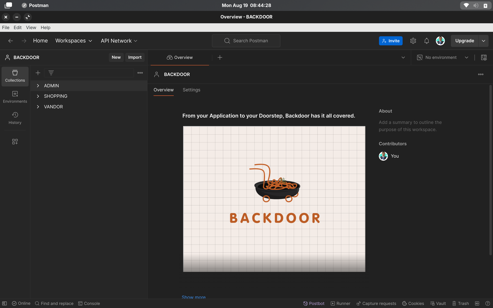
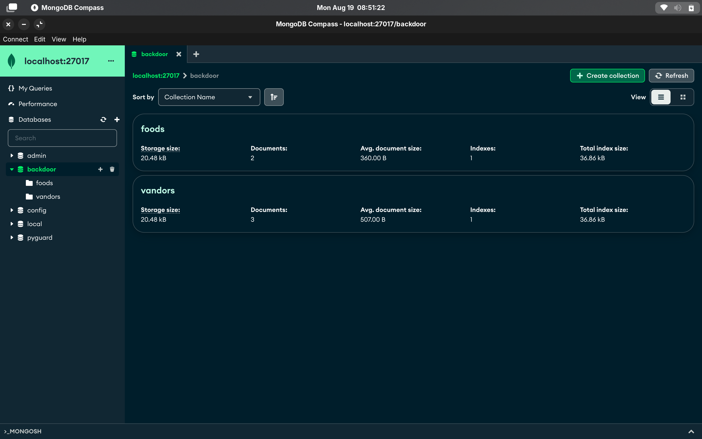

# BACKDOOR 
**From your Application to your Doorstep, Backdoor has it all covered**.


## PACKAGES FOR THE PROJECT

```bash
  npm install bcrypt @types/bcrypt
```
**bcrypt** is a Node.js library for securely hashing and salting passwords, ensuring that even identical passwords produce unique hashes, protecting against brute-force attacks and enhancing overall security.

```bash
  npm install cors @types/cors
```
**CORS** (Cross-Origin Resource Sharing) is a security feature in web browsers that allows or restricts web applications from making requests to a different domain than the one serving the web page.

```bash
  npm install express @types/express
```
**Express** is a minimal and flexible Node.js web application framework that provides a robust set of features for building web and mobile applications, including routing, middleware support, and HTTP utilities.

```bash
  npm install mongoose @types/mongoose
```
**Mongoose** is a Node.js library that provides a schema-based solution for modeling and interacting with MongoDB databases, enabling data validation, relationship management, and easy CRUD operations.

```bash
  npm install body-parser
```
**Body-parser** is a middleware in Express.js used to parse incoming request bodies in a middleware before your handlers. It supports parsing JSON, URL-encoded, and raw data formats.

```bash
  npm install jsonwebtoken @types/jsonwebtoken
```
**jsonwebtoken** is a Node.js library used for securely transmitting information between parties as a JSON object. It's commonly used for authentication, generating and verifying JSON Web Tokens (JWTs).

```bash
  npm install multer @types/multer
```
**Multer** is a Node.js middleware for handling multipart/form-data, primarily used for uploading files in Express applications. It processes incoming file uploads and stores them in specified locations.


## RUNNING THE PROJECT LOCALLY 
Git clone the project using the project HTTP / SSH link.

```bash
  git clone <link>
```
Use the 'll' terminal command to list the directories.
```bash
  ll
  ls -al
```
```bash
  cd backdoors/
```
Installing the dev-dependency packages for the project.
```bash
  npm install
```
Initiating the MongoDB Compass
```bash
  sudo systemctl status mongod
```
```bash
  sudo systemctl start mongod
```
Initiating the project server
```bash
  npm start
```

## API ROUTES

```http
    http://localhost:
```

| PORT | HANDLER     | 
| :-------- | :------- | 
| `8001` | `ADMIN-ROUTE` | 
| `8002` | `VENDOR-ROUTE` | 
| `8003` | `FOOD-ROUTE` | 


## API ROUTING PATHS

### ADMIN ROUTE `http://localhost:8001/`

```http
  POST :http://localhost:8001/createvandor
```
```http
  GET :http://localhost:8001/allvandors
```
```bash
  GET :http://localhost:8001/vandor/<link>
```

### VENDOR ROUTE `http://localhost:8002/`
```http 
  POST :http://localhost:8002/login
```
```http
  GET :http://localhost:8002/profile
```
```http
  PATCH :http://localhost:8002/profile
```
```http
  PATCH :http://localhost:8002/service
```
```http
  POST :http://localhost:8002/addfood
```
```http
  GET :http://localhost:8002/allfoods 
```

### SHOPPING ROUTE `http://localhost:8003/`
```http
  GET :http://localhost:8003/<pincode>
```
```http
  GET :http://localhost:8003/top-restaurant/<pincode>
```
```http
  GET :http://localhost:8003/foods-in-30/<pincode>
```
```http
  GET :http://localhost:8003/search/<pincode>
```
```http
  GET :http://localhost:8003/restaurant/<pincode>
```

## POSTMAN CONFIGURATION


## MONGODB CONFIGURATION


## DOCKER CONTAINERIZATION


## PROJECT CONTRIBUTORS 

| AUTHOR               | PROFILE                                    |
|--------------------|------------------------------------------------|
| SUVAJIT KARMAKAR  | [LINK](https://github.com/SUVAJIT-KARMAKAR) |
| HRISHABH GAUTAM   | [LINK](https://github.com/hrishabh-16)       |
| MANOSWITA BOSE     | [LINK](https://github.com/manoswita2501)       |

## PROJECT TIMELINE 
- (5) 00:00:00


